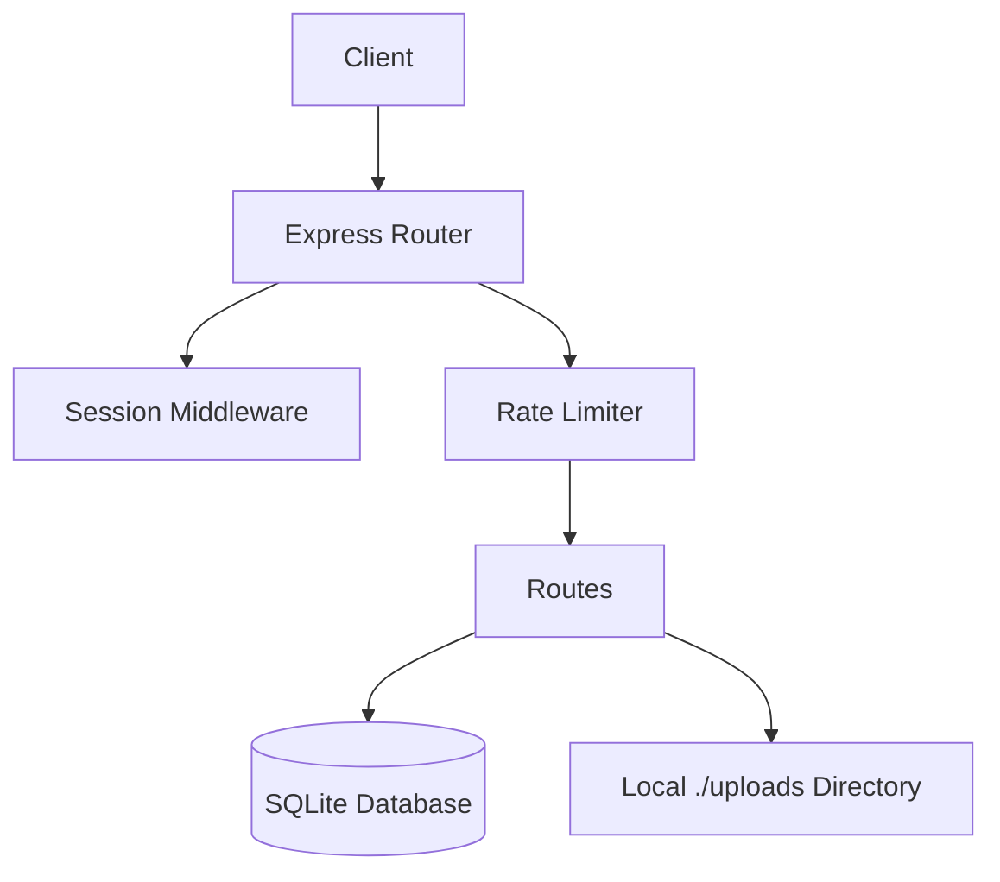

# Architecture Report

## Frontend Architecture
- **Framework:** React 19 (via Vite)
- **Styling:** Tailwind CSS (v4)
- **Routing:** Handled manually or via simple React state (checking App.tsx)
- **Components:** `AdminPanel.tsx` and `GuestPanel.tsx`.

## Backend Architecture
- **Server:** Node.js with Express (`server.ts`)
- **API Runtime:** TypeScript (using `tsx` during dev, `esbuild` to CommonJS for prod)
- **Rate Limiting:** `express-rate-limit` for generic APIs and login.
- **Logging:** `pino` and `pino-http`
- **Security:** `helmet` (partially configured to allow inline scripts/blobs for canvas) and `cors`

## Database Architecture
- **Database Engine:** SQLite3 (via `sqlite` wrapper)
- **Schema:** 
  - `events`: Defines events, limits, sync settings.
  - `media`: Defines uploaded photos/videos, associated with an `eventId`.
  - `admins`: Stores hashed passwords and usernames.
- **ORM/Query Builder:** Raw SQL with parameterized queries.

## Upload Pipeline
- **Middleware:** `multer` handling disk storage.
- **Destination:** Locally stored in `./uploads` directory.
- **Processing:** Direct write to disk, MIME type validation before saving.

## Authentication Flow
- **Session:** `express-session` using in-memory store (MemoryStore).
- **Admin Setup:** Auto-generates default admin on startup.
- **Login API:** Uses `bcryptjs` for comparing password hashes.

## Media Processing Flow
- **Image/Video Support:** Accepts JPG, PNG, HEIC, MP4, MOV.
- **Dependencies Available:** `fluent-ffmpeg`, `sharp` (installed but are they used? Will check in components)

## Event Flow
- Real-time or polling-based fetching of events and media via simple REST endpoints.
- "Instant" vs "Delay" reveal strategies for media logic.

## Build Pipeline
- `vite build` to bundle frontend into `/dist`
- `esbuild` packages `server.ts` into a standalone `dist/server.cjs` file, marking `dependencies` as external.

